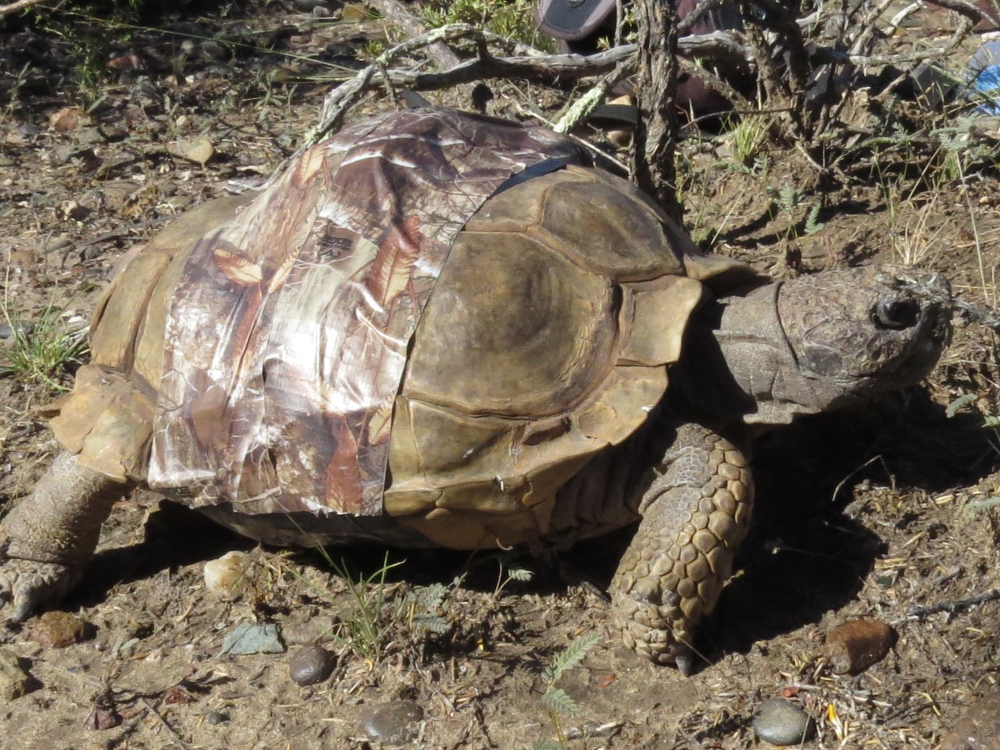
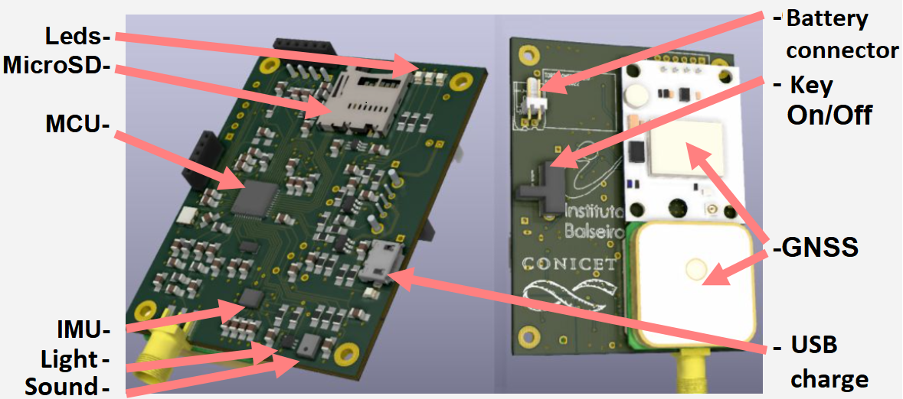
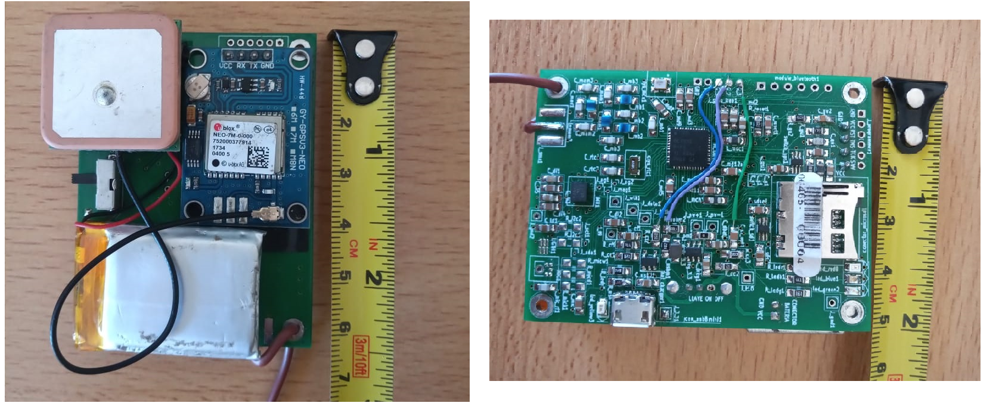
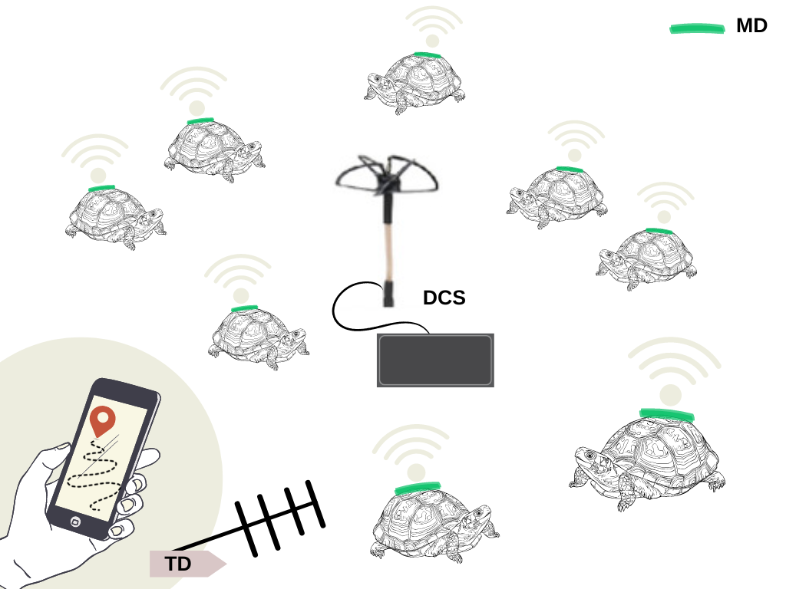

# Presentation
This repository features the firmware codes associated with the design of a family of devices created to monitor animal behaviour. These designs are applied to the monitor of the tortoise species ["Chelonoidis chilensis"](https://en.wikipedia.org/wiki/Chaco_tortoise). The goal of this device family is to allow the interdisciplinary research group to gather data from each tortoise (like temperature, position and movement-related data like acceleration) and then use this information to find behaviour patterns with the aim of empowering politics in order to improve the preservation of this species. 

 

#### You can find more information in this paper: 
[Design and Development of a Family of Integrated Devices to Monitor Animal Movement in the Wild ](https://www.mdpi.com/1424-8220/23/7/3684) 

#### In the following awarded project there are additional works related to this research topic: 
[Study of animal movement: equipment design and development](https://www.hackster.io/471203/study-of-animal-movement-equipment-design-and-development-febb17) 

&nbsp;

&nbsp;

###     Monitoring device: 3D model (Left)   <<--------------------------->>(Right) physical implementation 
 

 
&nbsp;

&nbsp;

&nbsp;

&nbsp;

&nbsp;

&nbsp;

## Introduction

The goal of this work is the creation of a family of devices that allow for the monitoring of tortoises. To achieve this, a solution was proposed consisting of a Monitoring Device (MD), a Tracking Device (TD), and a Data Collection Station (DCS). The MD is the device that is placed on the animal to be monitored, collecting various data of interest and transmitting two types of radio frequency signals: one containing part of the collected information to enable the researcher to monitor the status of the devices through the DCS while the MDs are acquiring data, and another one without information, referred to as the "Keep Alive pulse" (KA), which allows for device retrieval using the TD. The DCS is the member of the family responsible for collecting the information sent by radio frequency from the different active MDs, allowing the researcher to visualize this information in real time through a PC connected to it. This includes data such as the battery level or geolocation of each MD, along with the geolocation of the DCS itself. On the other hand, the TD allows the researcher to locate the device using a Yagi-Uda directional Antena integrated into the TD, along with an interface, such as a smartphone connected via Bluetooth to the TD, which allows the user to select the device they want to track and provides qualitative information about the device's proximity. Because of the use of a directional antenna, if the TD antenna is not pointing directly to the MD, the received power from the KA decreases. This means that by showing the user the power received (for example, by creating a relation between a buzzing sound and the received power value), the User can correct the pointing direction of the antenna in order to get the maximum power received and therefore know the direction in which the MD is located and move towards that path until it reaches the MD. This method was inspired by already existing commercial equipment such as the ATS (Advanced Telemetry Systems).

In the next figure, the illustration shows the interaction between the different devices, where multiple MDs are placed on turtle shells, collecting data and transmitting a portion of this data via RF, which is received by the omnidirectional antenna of the DCS. Meanwhile, a researcher is using a mobile device linked to the TD along with a Yagi-Uda directional antenna to locate a particular individual.

 


## Platorm
The platform used for acquisition is composed of an MD (Monitoring device), which is custom hardware that must be attached to the Animal in order to acquire the information used for animal behaviour research. Also, other devices are used in order to support the MD. These devices allow the user to gather Radio Frequency data sent by MD in order to allow a range monitoring of the device status and help the recovery of the attached MD.
* Hardware: Custom printed circuit board featuring the Texas Instruments CC1312R1 System on Chip.
  * Radio Communication: 150 MHz band, 2-GFSK modulation. The radio is included inside the CC1312R1 chip and sends two kind of messages:
  **  Keep Alive Pulses: Short pulses with no information. By using a Tracking Device (TD)
  * Sensors:  
    * IMU: Temperature + Accelerometer + Gyroscope + Magnetometer.
    * GPS receptor U-blox NEO 7M: Position.
  * Lights: 3 LEDs
  * Battery: LiPo 3.7V-600mAh.
  * Battery Charger: USB-B micro. 
  * SD Slot: Allow the acquired information from sensors to be stored in the SD CARD.
* Firmware and SDK:
  * IDE: Code Composer Studio Version 11.1
  * SDK: [Simple Link SDK Version 6.30](https://www.ti.com/tool/download/SIMPLELINK-CC13XX-CC26XX-SDK/6.30.01.03)
  * Compiler: TI Clang Version 2.1
* Software:
  * Decoder: Python. Convert binary information stored in the SD card to human readable information, which are pandas-compatible 
## Firmware features: Table of Contents

- [Modular Design and Scalability](#modular-design-and-scalability)
- [State Machine and Task Activation Modes](#state-machine-and-task-activation-modes)
- [Power Consumption Optimization](#power-consumption-optimization)
- [Conclusion](#conclusion)
- [Firmware selection](#firmware-selection)

## Modular Design and Scalability

The firmware embraces a modular design, which facilitates maintainability and scalability. Each functional block is encapsulated as a separate module, promoting reusability and easier management of complex systems. As the firmware grows, additional functionalities can be integrated without disrupting the existing codebase. This modularity also enables collaboration among multiple developers, each focusing on specific modules.

The scalable architecture ensures that the firmware accommodates future enhancements and modifications without requiring a complete overhaul. New sensor tasks, communication protocols, or data processing methods can be integrated smoothly, making the system adaptable to evolving requirements.

## State Machine and Task Activation Modes

The firmware employs a state machine model to manage the device's behaviour. It operates in different modes, each optimized for specific scenarios:

1. **Normal Mode:** This mode includes a set of tasks actively engaged based on the device's intended operation. For instance, during standard data collection, sensor tasks and communication modules are active.

2. **Low-Power Mode:** In situations where continuous operation isn't necessary, the system can transition to a low-power state. Unnecessary tasks are suspended, reducing power consumption while maintaining essential functionalities like periodic activity monitoring.

3. **Animal Behavior-Dependent Mode:** To optimize power usage further, the firmware monitors animal behaviour and adjusts its operation accordingly. If the animal remains inactive for a specified duration, non-critical tasks are suspended, and the device enters a sleep state. This feature minimizes energy consumption during periods of inactivity.

## Power Consumption Optimization

The firmware's design, state machine operation, and task activation modes directly impact power consumption:

- **Modular Deactivation:** Inactive modules consume minimal power, contributing to overall energy efficiency. During low-power modes or when specific tasks are not required, the firmware deactivates those modules, drastically reducing power draw.

- **Selective Task Activation:** The ability to activate or deactivate tasks based on the device's current mode is a significant power-saving feature. In Animal Behavior-Dependent Mode, the firmware selectively activates tasks related to animal activity monitoring, effectively saving energy.

- **Dynamic Frequency Scaling:** Certain modules, like the RF module, might consume higher power during transmission. By dynamically adjusting the transmission frequency based on system requirements, the firmware can further optimize energy consumption without compromising essential operations.

- **State Transition Logic:** Transitions between different modes are managed intelligently, ensuring that power-hungry tasks are only active when necessary. This dynamic switching minimizes energy expenditure and extends the device's operational time.

## Conclusion

The firmware's modular design, scalability, state machine operation, and power consumption optimization collectively contribute to a robust and adaptable system. The ability to tailor the device's behavior based on task activation and animal behavior not only ensures efficient energy usage but also enhances the overall reliability and longevity of the device's operation.

For detailed implementation guidelines and real-world use cases, consult the comprehensive documentation within the repository.

# FAQ

## There is only One firmware code and device board, how do I select my device application?

In the case of the hardware, you must add

### Firmware selection
In the case of the firmware, there is a series of macros created in order to allow the user select the different devices modes
In order to do so, you must edit the `DEVICE_SYSTEM_CONFIG.h` header file, which contains various configuration settings and macros that allow you to customize the behavior of your device and system.

#### Animal and Device Kind Selection

In this section, you can define unique identifiers for different animal types or applications and types of monitoring devices. These identifiers are used throughout your code to specify the device's purpose and kind of animal being monitored. \
Options \
```c
#define ANIMAL_TORTOISE_SAO 48488448468
#define ANIMAL_LIZARD 48986556565

#define DEVICE_TYPE_MD 488685535  // Monitoring device
#define DEVICE_TYPE_TD 89198568   // Tracking device
#define DEVICE_TYPE_DCS 48488848  // Data Collector Station
```
Example of selection \
```c
#define DEVICE_TYPE_KIND DEVICE_TYPE_MD
#define DEVICE_TYPE_ANIMAL ANIMAL_TORTOISE_SAO
```
#### System Configuration

Also, the are other defines that allows you to select diferent parameters related to the general : 

    * UART Printing: RTOS_PRINTU controls whether UART print functions are enabled.

    * SD Card Storage: SD_STORAGE_ON enables or disables SD card storage for collected data.

    * Development Board: DEVELOPMENT_BOARD_EMPTY can bypass most functions when using a development board  of SoC CC1312R that does not have the custom hardware specific sensors that are required for the normal RUN of the device.

    * LED Configuration: Customize LED tilting duration and period.

    * IMU Sensors: Set accelerometer and gyroscope sample rates.

    * Magnetometer Sensor: Configure the magnetometer sample rate.

    * Animal Activity Detection: Enables the detection and inclusion of animal activity (specific to certain devices and animals). You can also enable differents power modes based of animal activity detection (for example, turning off gyroscope to save power).

    * GPS Setup: Configure GPS data collection and acquisition settings.

    * RF Setup: Define radio transmission parameters such as power levels, frequencies, and transmission periods.

    * Battery-Related Parameters: Configure battery levels and charging settings based on the type of battery used in your project.

##### Test Modes

There are commented-out lines in the file that define specific test modes. These modes can be uncommented to enable certain testing mode for the device in order to help debugging.

# Example of Tasks Behaivour

#### Interaction Between `printuf` and `task_uart0_printu_print` Tasks

In complex software systems, tasks often need to communicate and synchronize their actions to achieve coordinated behaviour. Let's explore the interaction between two tasks, `printuf` and `task_uart0_printu_print`, in the context of printing and UART communication.

##### Task Descriptions

- **printuf Function**: The `printuf` function handles formatted printing, acquiring a semaphore to add data to the print queue. It formats the input string, appends it to the queue if space is available, and signals the `task_uart0_printu_print` task to print.

- **task_uart0_printu_print Function**: The `task_uart0_printu_print` task waits for a semaphore indicating data availability in the print queue. When data is present, it extracts and sends the data over UART, ensuring synchronization with UART access.

#### GPS Data Acquisition Task

The provided code snippet represents a GPS data acquisition task designed to run within an RTOS environment. This task is responsible for interfacing with a GPS module, parsing incoming GPS data, and storing the acquired information in memory. The task demonstrates a comprehensive flow that encompasses GPS module interaction, data parsing, storage management, and interaction with other parts of the system.

#### Key Components:

 * GPS Module Interaction: The task initializes and interacts with a GPS module using UART communication. It configures the GPS module to receive specific types of messages and processes the received bytes in a callback function. This interaction ensures continuous reception of GPS data.

 *  GPS Data Parsing: The code employs the TinyGPS++ library to parse the received GPS data. It extracts information such as latitude, longitude, date, time, and precision. The parsed data is stored in appropriate data structures.

 * Data Storage: The task utilizes memory structures to store the parsed GPS data. It maintains buffers to accumulate messages and organizes them into structured blocks for storage. The task controls the flow of data storage, ensuring that required messages are stored correctly.

  * RF Data Transmission: The task passes relevant GPS data to an RF module for transmission. It prepares data packets containing information like latitude, longitude, and time, which can be transmitted wirelessly.

  * State Machine Integration: The task interacts with a state machine to coordinate its operation. It waits for a specific state to be reached before initiating GPS data acquisition. Additionally, the task responds to system low-power states by exiting its processing loop.

  * Periodic Acquisition: After an initial GPS data acquisition, the task enters a periodic acquisition loop. It repeatedly acquires GPS data, parses it, stores it, and updates RF transmission packets. The acquisition interval is determined by the specified frequency.

####  Flow and Interaction:

The task initializes UART communication with the GPS module and configures the module's behavior. It interacts with the GPS module through callback functions triggered by UART reception. The received data is accumulated and processed using the TinyGPS++ library.

The parsed GPS data is then stored in memory structures. These structures are designed to organize and store different types of GPS messages, including information about location, time, and precision. The task also handles the transmission of parsed GPS data to an RF module for wireless communication.

The GPS data acquisition task coordinates with a state machine, ensuring proper synchronization with the system's operational states. Additionally, the task accommodates system low-power states, allowing for efficient resource utilization.

Overall, this GPS data acquisition task demonstrates a well-structured approach to interfacing with GPS modules, parsing data, and managing acquired information within an RTOS environment.

#### GPS task Diagrams
```mermaid
flowchart LR
    subgraph GPS Data Acquisition Task
    InitializeGPS -->|Start| ParseGPSData --> StoreData --> PassDataToRFModule --> CheckGPSAcquired
    end
    CheckGPSAcquired -->|Yes| ParseGPSData
    CheckGPSAcquired -->|No| Stop

    subgraph CheckGPSAcquired
    style CheckGPSAcquired fill:#f9f,stroke:#333,stroke-width:2px
    Yes((Yes))
    No((No))
    end
